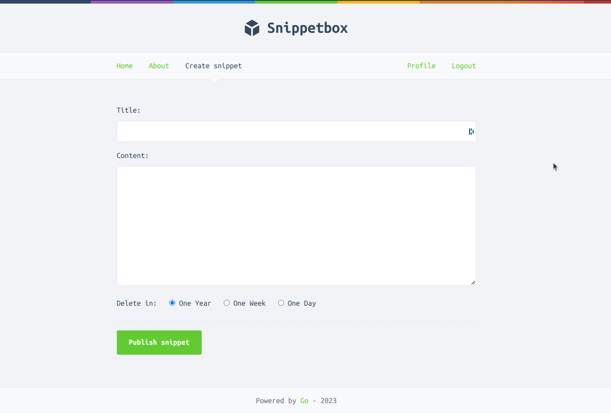

# Snippetbox

Snippetbox share the same concept as the famous [GitHub Gist](https://gist.github.com/) where people can share snippets of text.


# Table of Contents
* [Motivation](#motivation)
* [Key Takeways](#key-takeaways)
* [Setup](#setup)
* [Usage](#usage)
* [Credits](#credits)
* [License](#license)

# Motivation
This application was created with the purpose of learning [Go](https://go.dev/). I believe that only by combining theoretical knowledge with practical experience you can you truly understand it. 

I find quite hard to find technical books that focus more on the pratical side, that is why when I came across [Alex Edwards](https://www.alexedwards.net/) books I was over the moon. 

After reading some reviews on [r/golang](https://www.reddit.com/r/golang/) about his books I was confident that would be a good investment and now I must say that I completely agree with the popular opnion!

# Key Takeaways
* HTML Templating
* RESTful Routing
* Configuration Management
* Level logging and centralized error handling
* MySQL Database
* Middlewares
* Session Management
* Security (HTTPS,OWASP Secure Heards and CSRF)
* Authentication and Authorization
* Contexts
* Testing


# Setup
The easiest way to get the application up and running is using Docker (see [Running on Docker](#running-on-docker)  for more details). 

Assuming you wan't to run the application with Go and use your own database please follow the required steps in the next section [Running with Go](#running-with-go).

## Running with Go
### Requirements
* Go 1.20
* MySQL

For the database connection there are two options:
1. Use the default configuration (expect to have MySQL running on port 3306 at localhost). When the application starts it will bootstrap the initial data, creating the necessary tables and user.
2. Use your own DSN and set the flag `dsn` to point to a valid DSN value.

### Running Snippetbox
At the root of the project run the following commands:
```
$ go mod tidy
$ go run ./cmd/web
```
# Usage
*The application is running on HTTPS. Eg: https://localhost:4000*
## Configuration Management
Snippetbox supports configuration management for the following flags:
* _addr_ - Port Address (default is ':4000')
* _dsn_ - DSN (default is 'web:lua@/snippetbox?parseTime=true')*
* _debug_ - Debug mode (default is false)

*_It is very important to set 'parseTime=true', otherwise the mapping for dates may not work properly_
### Example:
```
$ go run ./cmd/web -debug -port=:8080 -dsn=john:pass@/mybox?parseTime=true
```
 It will run on _port_ 8080 with _debug_ mode on and also the _database connection_ will point to  localhost user 'john' with a password of 'pass' for the schema 'mybox'

## API
<table>
<thead>
<tr>
<th>Method</th>
<th>Pattern</th>
<th>Action</th>
</tr>
</thead>

<tbody>
<tr>
<td>GET</td>
<td>/</td>
<td>Display the home page</td>
</tr>

<tr>
<td>GET</td>
<td><span>/snippet/view/:id</span></td>
<td>Display a specific snippet</td>
</tr>

<tr>
<td>GET</td>
<td>/snippet/create</td>
<td>Display a HTML form for creating a new snippet</td>
</tr>

<tr>
<td>POST</td>
<td>/snippet/create</td>
<td>Create a new snippet</td>
</tr>

<tr>
<td>GET</td>
<td>/user/signup</td>
<td>Display a HTML form for signing up a new user</td>
</tr>

<tr>
<td>POST</td>
<td>/user/signup</td>
<td>Create a new user</td>
</tr>

<tr>
<td>GET</td>
<td>/user/login</td>
<td>Display a HTML form for logging in a user</td>
</tr>

<tr>
<td>POST</td>
<td>/user/login</td>
<td>Authenticate and login the user</td>
</tr>

<tr>
<td>POST</td>
<td>/user/logout</td>
<td>Logout the user</td>
</tr>

<tr>
<td>GET</td>
<td>/static/*filepath</td>
<td>Serve a specific static file</td>
</tr>
</tbody>
</table>


# Running on Docker
---- _SECTION IN PROGRESS_ ---

Assuming you have Docker daemon running you just need to run the following command:
```
$ docker-compose up
```
The application will be running on port :4000 by default.

# Credits
Snippetbox is part of the book [_Let's Go_](https://lets-go.alexedwards.net/) by [Alex Edwards](https://www.alexedwards.net/). I highly recommend this book for someone who is coming from another programming language to Go as the intention of the book is to show a real example of how to implement an application using the idiomatic Go.

# License
MIT License

Copyright (c) 2023 Jean Morelli

Permission is hereby granted, free of charge, to any person obtaining a copy
of this software and associated documentation files (the "Software"), to deal
in the Software without restriction, including without limitation the rights
to use, copy, modify, merge, publish, distribute, sublicense, and/or sell
copies of the Software, and to permit persons to whom the Software is
furnished to do so, subject to the following conditions:

The above copyright notice and this permission notice shall be included in all
copies or substantial portions of the Software.

THE SOFTWARE IS PROVIDED "AS IS", WITHOUT WARRANTY OF ANY KIND, EXPRESS OR
IMPLIED, INCLUDING BUT NOT LIMITED TO THE WARRANTIES OF MERCHANTABILITY,
FITNESS FOR A PARTICULAR PURPOSE AND NONINFRINGEMENT. IN NO EVENT SHALL THE
AUTHORS OR COPYRIGHT HOLDERS BE LIABLE FOR ANY CLAIM, DAMAGES OR OTHER
LIABILITY, WHETHER IN AN ACTION OF CONTRACT, TORT OR OTHERWISE, ARISING FROM,
OUT OF OR IN CONNECTION WITH THE SOFTWARE OR THE USE OR OTHER DEALINGS IN THE
SOFTWARE.
